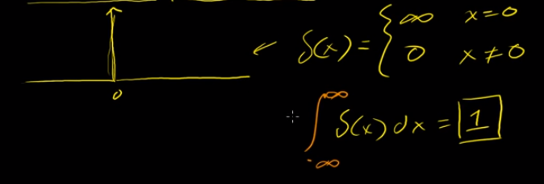
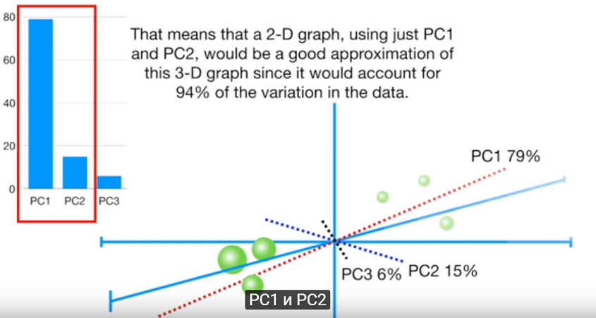
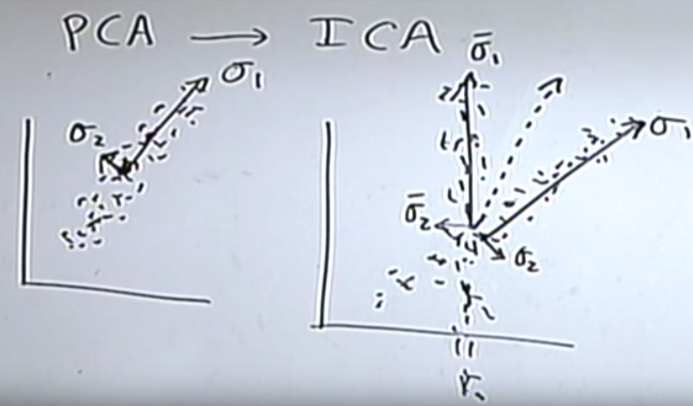
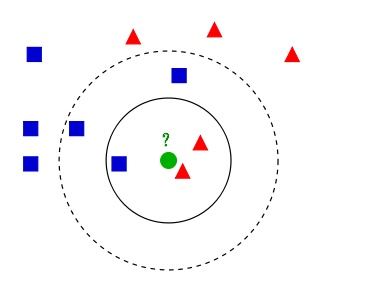

# Note

	总笔记目录

# Index

1. [图像学](#image)

2. [NLP](#NLP)

3. [数学](#math)

4. [机械学习](#ml)
	1. [预处理](#ml-pre)
	2. [学习算法](#ml-learn)

5. [深度学习](#DL)

## Math

###	狄拉克分布 dirac distribution
	https://www.khanacademy.org/math/differential-equations/laplace-transform/properties-of-laplace-transform/v/dirac-delta-function

	表示一个很突然的值，积分取值永远为1.
	
### PCA

	https://www.youtube.com/watch?v=FgakZw6K1QQ
	主成分分析，用于降维，也就是移除影响力较低的维度（特征）。

	简单的说就是通过把各个维度的值投影到一个新的坐标系（最吻合的
	然后计算各个维度的影响力，选最高的2个维度构成2D数据，也就是降至2D。
	
### ICA

	https://www.youtube.com/watch?v=_e4SN4TWlgY
	独立成分分析
	假设，数据中存在相互独立的分布模式。 并且数据不构成高斯分布（均匀散布）。

	那么应该可做到分离不同的模式的数据。
	具体的算法实现有很多个。

### SVD

	TBD

### 贝叶斯

	https://www.matongxue.com/madocs/279.html
	总之就是总和概率为1，那么各种先后下的概率。
	P(C) C的概率
	P(C,M) C,M都为真的概率
	P(C|M1,M2) M1,M2真的时候，C的概率

	总之后面就是一堆的数学了。

	朴素贝叶斯
	正常来说：P(C,X1,X2) = P(X1|X2,C)P(X2|C)P(C)
	也就是说，条件X1,X2是有互相关系的，但这样就太复杂了。
	假设条件都是独立，就叫做朴素（Naive）贝叶斯了。
	然后：P(C,X1,X2) = P(X1|C)P(X2|C)P(C)

	在这样获得条件下的事件概率后，就只需要算的全部概率，然后选最大的那个就行了。
	也就是最大后验概率，MAP maximum a posteriori

## NLP

	自然语言处理相关

### 词频，词袋，n-gram, TD-IDF

	一个词在文章中出现的频率，很大程度可以说明这个词的代表性。
	所以可以用词频作为文章描述的基础。

	把文章转为数据的一个做法是词袋，也就是把文章中出现的所有词丢进一个袋子，然后带计数。
	"然后mark就说, 后天说的那说法"
	[ 然：1，后:2, 说:3 ...	]

	n-gram,因为字词的前后顺序其实很重要。 所以包含多n个词的连续。
	比如2-gram，[然：1，后:2, 说:3 ... 然后:1, 后天：1 ...]

	TD-IDF 不但考虑了一个词出现的频率TF，也考虑了这个词在其他文档中不出现的逆频率IDF。
	也就是避免了没什么意义的公共词。

## Image

	和机械学习没有直接关系的图像的相关理论内容

### Image 光照和颜色

	图像上最后产生的颜色受3个东西影响：
	1.照射光，(光的颜色，强度
	2.物体对光的反射性质，（本身的颜色
	3.摄像设备的颜色特性

	因为图像上只有最后的一个颜色值，所以当需要还原物体真正的颜色时，是一个病态问题。

### 特征检测

	https://zh.wikipedia.org/wiki/%E7%89%B9%E5%BE%81%E6%A3%80%E6%B5%8B
	相关内容太多，词和各种算法也是一大堆。

#### 边缘检测

	Canny算子
	高斯滤波和一堆mask算法，存在阀值问题。	

#### 角点检测

	Harris角点检测等，基本都是通过窗口的灰度值变化来判断，应该不怎么靠谱。

#### HOG

	方向梯度直方图，
	也就是一个图片切成小块后，在窗口下的灰度方向（方向梯度/oriented gradient）。

#### SIFT/SURF

	有商业使用下的法律限制，用FAST替代。
	“SIFT能够找出独特的关键点，此关键点不会受移动、转动、缩放、仿射变换、亮度等外在因素的影响而改变其特性。因此能够有效应用在物体辨识上”

## Ml

## Ml-pre

	也就是数据的预处理，
	1.格式化
	2.错误数据排除
	3.采样
	---------下面是会修改数据的
	4.缩放，也就是把特征在数值上缩到一个范围内。
	5.分解/聚合，比如把登陆时间记录替换为登陆次数。

### 0，1化

	也就是阀值。

### 特征标准化(Z-score)

	也就是把某个特征缩放到均值为0，单位方差为0。
	每个数据点，特征x，(x - 全体均值)/方差
	比如  	1     	2     	3    	 4 
	mean = 2.5, std = 1.2910
	结果		-1.1619   -0.3873    0.3873    1.1619

### 特征归一化

	把特征全缩放到[0,1]，通过除以最大的那个值。
	或[-1,1]，Xi-min(X)/max(X)-min(X)

### 维度压缩

	也就是当特征集维度增加时，学习需要的数据量会指数增加，所以需要降维。
	比如PCA，ICA等

### 非数值特性的数值化
	
	也就是编码成数字，比如固定值或者文本。
	文本时，比如TF-IDF，也就是词频。然后就会开始扯上NLP的东西了。

## Ml-learn

### linear-regression

	也就是线性回归，通过在N维的空间内通过简单的线性方程匹配现有数据建模。

### K-NN

	简单的一种分类算法，也就是通过判断（新值的）K个最近样本中占最多数的类型是什么，
	来决定新值的类型。
	基于“相似的样本会聚集在一起”这个假设，K值是个超参，直接影响结果。

### SVM

	支持向量机
	如图所示，是为了找最合适的划分线
	

	SVM本身是一个线性分类器，当数据线性不可分时可以通过升维度处理。
	https://wizardforcel.gitbooks.io/dm-algo-top10/content/svm-4.html

	具体数学TBD

### K-Means

	聚类算法，也就是从未标记的数据中，寻找预设的k个聚类。
	假设：类似的数据以一个中心聚集。

	算法通过一个叫期望最大化的过程实现，大致就是先随机分中心，然后通过不断更新中心位置直到收敛。

### 期望最大化

	1.无法保证局部最优解。
	2.需要提供类型数K，或使用算法寻找合适的K
	3.边界是线性的（中心假设）
	4.数据量大时的性能问题，可通过Batch版解决。

## DL

	深度学习

### 基本步骤

	1.训练数据
	2.损失函数
	3.学习规则，也就是怎么通过迭代和损失函数寻找最优解。

### DNN

	深度神经网络， Deep neural network

	也就是以类似神经系统的概念构成的学习网络。
	基本思路是用某种相同单元多层堆叠形成强大的学习能力。

### CNN

	曲卷神经网络，Convolutional Neural Network
	也就是在全连接的层前面包含的预处理层，通过卷积算子。

### BP

	误差反向传播, Back propagation
	神经网络学习的原理，之一？

### HMM

	隐式马尔科夫

### RNN

	循环神经网络，Recurrent neural network
	可以形成"关联/记忆"的学习网络，比如文章的上下文，物体间关系。

	但直接全计算的话，计算量会爆炸。

### LSTM 

	长短期记忆网络，Long short-term memory

	

